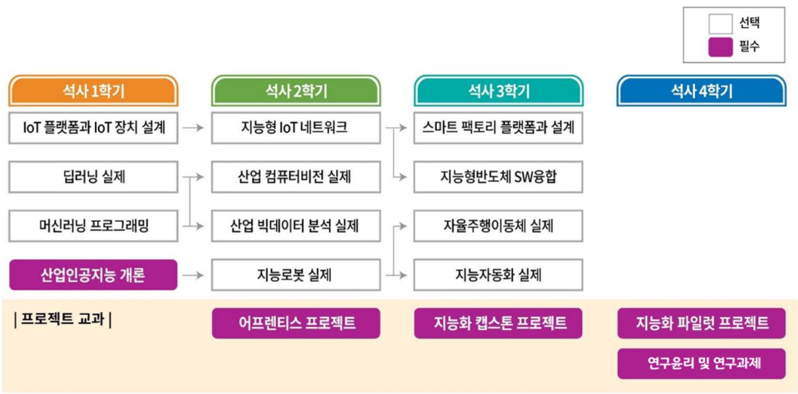

# **Industrial AI Portfolio** 
 

## Introduction

2020년 9월 산업인공지능학과 입학
  

## Contacts

- e-mail : beomi0921@hanmail.net
 

## Educational Course

  

 

### 수강중인 과목

- `2020-09` [어프렌티스 프로젝트](https://github.com/psb1008/industrial-AI/tree/master/projects/어프렌티스-프로젝트): 문제해결방법론 교육 및 프로젝트 준비
- `2020-09` [산업 컴퓨터비전 실제](https://github.com/psb1008/industrial-AI/tree/master/projects/산업-컴퓨터비전-실제): OpenCV를 활용한 영상 개선, 영상 분할, 객체 검출/추적 구현 

